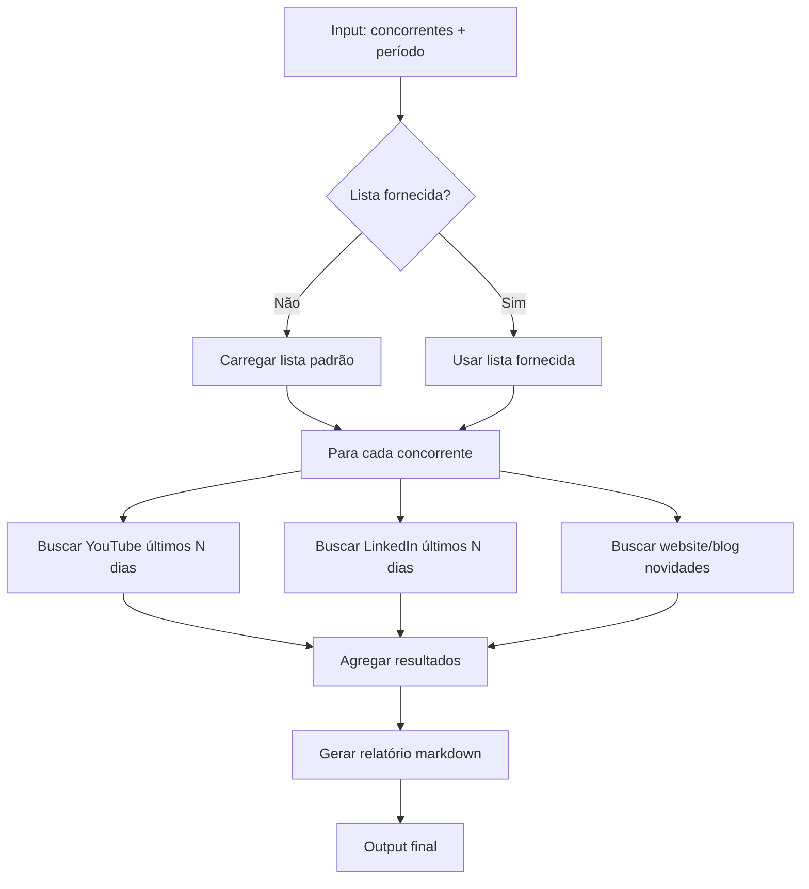

# /monitorar-concorrentes

**Squad:** radar  
**Agente:** @analista-mercado  
**Status:** ⚪ ESQUELETO — placeholder declarado, sem implementação

---

## Descrição

Monitor de concorrentes do nicho squad IA. Detecta movimentações relevantes (posts novos, vídeos, lançamentos de produtos) das últimas N semanas.

**Concorrentes conhecidos:**
- Hugo Rocha (Apto)
- Bruno Okamoto
- Daniel Coimbra
- Outros a mapear

---

## Input

| Campo | Tipo | Obrigatório | Default |
|---|---|---|---|
| `concorrentes` | string[] | Não | lista padrão do banco |
| `periodo` | int (dias) | Não | 14 |

---

## Output

Relatório markdown estruturado:

```markdown
# Relatório de Monitoramento — [Data]

## Hugo Rocha
- **YouTube:** 3 vídeos novos (títulos + links + views)
- **LinkedIn:** 2 posts relevantes (temas + engajamento)
- **Produtos:** sem novidades

## Bruno Okamoto
- **YouTube:** 1 vídeo novo
- **LinkedIn:** post sobre [tema]
- **Produtos:** lançamento de [produto]

## Síntese
- Top movimentações da semana
- Padrões detectados
- Oportunidades para o Gui
```

---

## Bateria de testes (Regra Inviolável #24)

**Quando implementar, garantir:**

- [ ] Concorrentes padrão carregados corretamente
- [ ] APIs sociais retornam dados válidos (não 404/rate limit)
- [ ] Período de monitoramento respeitado (não pega dados mais antigos)
- [ ] Output markdown bem formatado
- [ ] Timeout configurado (max 60s por concorrente)
- [ ] Stderr capturado + exit code check
- [ ] Graceful degradation se 1 concorrente falhar (não trava todo relatório)

---

## Fluxo



---

## Implementação futura

**Tecnologias:**
- YouTube Data API (quota 10k/dia)
- LinkedIn API (a validar permissões)
- Web scraping respeitoso (Beautiful Soup + rate limiting)

**Armazenamento:**
- Histórico em `workspace/output/radar/historico-concorrentes/`
- Banco de concorrentes em `squads/radar/concorrentes.json`

---

## Histórico

- **11/05/2026:** Skill ESQUELETO criada (Onda B1) — estrutura declarada, sem implementação
