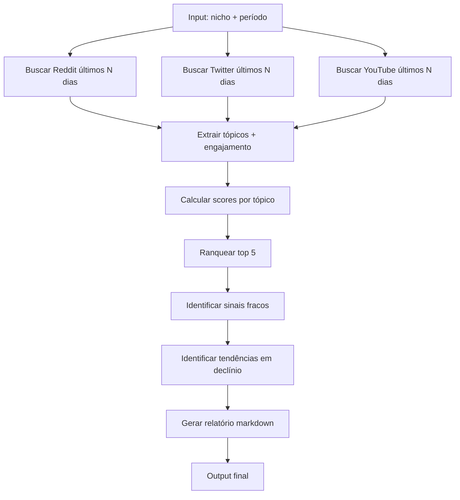

# /varrer-tendencias

**Squad:** radar  
**Agente:** @analista-tendencias  
**Status:** ⚪ ESQUELETO — placeholder declarado, sem implementação

---

## Descrição

Varredura de Reddit, Twitter/X, YouTube atrás de sinais de tendência emergentes. Identifica hot topics no nicho (squad IA, automação, creator economy, etc) antes de virarem mainstream.

**Fontes primárias:**
- Reddit: r/ChatGPT, r/ClaudeAI, r/LocalLLaMA, r/CreatorEconomy
- Twitter/X: hashtags #AIAgents #AutomationTips #NoCode
- YouTube: trending no nicho + vídeos emergentes (growth rápido)

---

## Input

| Campo | Tipo | Obrigatório | Default |
|---|---|---|---|
| `nicho` | string | Não | "squads de IA" |
| `periodo` | int (dias) | Não | 7 |

---

## Output

Relatório markdown estruturado:

```markdown
# Tendências Emergentes — Semana [Data]

## Top 5 Tendências

### 1. [Tema/Tópico] — Score 8.5/10
**Fontes:** Reddit (r/ChatGPT), Twitter (#AIAgents), YouTube (3 vídeos)  
**Velocidade:** +340% menções últimos 3 dias  
**Descrição:** [resumo do que é a tendência]  
**Oportunidade para Gui:** [ângulo possível]

### 2. [Tema/Tópico] — Score 7.2/10
...

## Sinais fracos (watch list)
- [Sinal 1]: ainda pequeno mas crescendo
- [Sinal 2]: nicho mas promissor

## Tendências em declínio
- [Tema X]: pico passou, engajamento caindo
```

---

## Bateria de testes (Regra Inviolável #24)

**Quando implementar, garantir:**

- [ ] APIs conectam corretamente (Reddit, Twitter, YouTube)
- [ ] Rate limiting respeitado (não bate quota)
- [ ] Score calculado com critério claro (velocidade + volume + relevância)
- [ ] Período de varredura respeitado (não pega dados mais antigos)
- [ ] Output markdown bem formatado
- [ ] Timeout configurado (max 90s total)
- [ ] Stderr capturado + exit code check
- [ ] Graceful degradation se 1 fonte falhar (não trava todo relatório)

---

## Fluxo



---

## Implementação futura

**Tecnologias:**
- Reddit API (rate limit 60 req/min)
- Twitter/X API (a validar plano)
- YouTube Data API (quota 10k/dia)
- NLP/embeddings pra agrupar tópicos similares

**Scoring (critério inicial):**
```python
score = (
  velocidade_crescimento * 0.4 +
  volume_mencoes * 0.3 +
  relevancia_nicho * 0.3
)
```

**Armazenamento:**
- Histórico em `workspace/output/radar/historico-tendencias/`
- Base de tendências em `squads/radar/tendencias.json`

---

## Histórico

- **11/05/2026:** Skill ESQUELETO criada (Onda B1) — estrutura declarada, sem implementação
